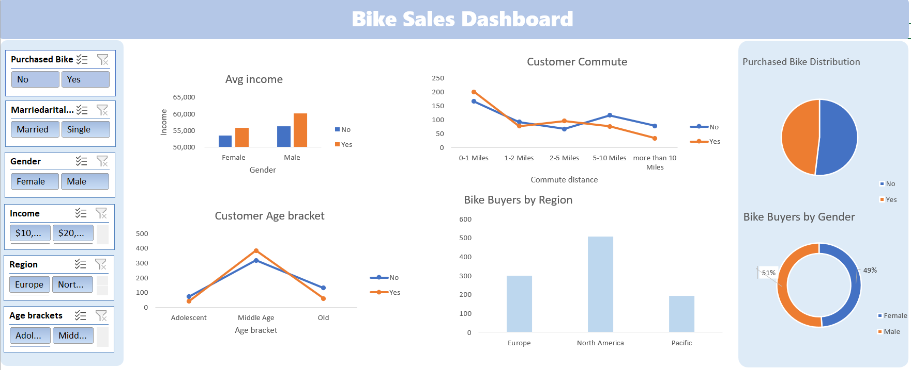

# 🚲 Bike Sales Analysis Dashboard

## 📌 Project Overview

This project analyzes bike sales data to identify sales trends, customer behavior, product performance, and key business insights.

The project was developed using **Excel**, with a focus on data preparation, analysis, and interactive dashboard visualization.

## 🛠️ Tools Used

* Microsoft Excel
* Pivot Tables
* Pivot Charts
* Slicers
* Data Cleaning & Analysis

## 📊 Dashboard

The interactive dashboard provides an overview of bike sales performance and allows users to explore the data through different dimensions and filters.

### Dashboard Preview



## 🔎Key Analysis

The analysis focuses on:

* Sales performance and trends
* Customer demographics
* Product and bike performance
* Revenue analysis
* Regional and customer-level patterns
* Key business KPIs

## 💡 Key Insights

The dashboard helps identify:

* Which products contribute most to sales
* Customer purchasing patterns
* Sales trends across different categories
* Differences in performance across regions
* Key factors affecting overall sales performance

## 📁 Project Structure

```text
Bike-Sales-Analysis-Dashboard/
│
├── Bike_Sales_Dashboard.xlsx
├── bikedashboard.png
└── README.md
```

## 🎯 Project Goal

The main goal of this project was to practice transforming raw sales data into a clear and interactive dashboard and to develop a better understanding of how data analysis can support business decision-making.

## 👩‍💻 Author

**Aysel Hasanova**

Data Analytics  | SQL | Python | Pandas | Excel
